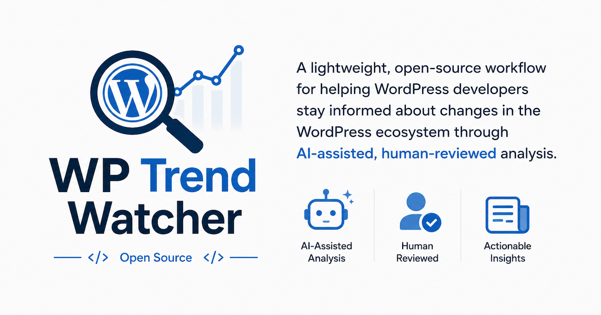

# WP Trend Watcher



WP Trend Watcher is a lightweight, open-source workflow for helping WordPress developers stay informed about changes in the WordPress ecosystem through AI-assisted, human-reviewed analysis.

The goal is not to automate opinions, replace expertise, or publish without review.

The goal is to collect useful WordPress ecosystem updates, summarize them efficiently, review them with human judgment, and produce a weekly report that developers can actually use.

## Status

Phase 2 complete. The repo now has:

- **6 sources** (4 Tier 1 + 2 Tier 2) with clean collection summaries
- **sources.yaml** for user-customizable sources
- **HTML reports** with self-contained styling, generated alongside Markdown
- **GitHub Pages** deployment via GitHub Actions on push to main
- **First weekly report** published and committed

## Intended Audience

Freelance and agency WordPress developers who want to stay current without reading every Make post, Developer Blog update, and ecosystem article.

## Quick Start

```bash
git clone https://github.com/colorful-tones/wp-trend-watcher.git
cd wp-trend-watcher
pnpm install
cp .env.example .env   # edit if using a different model or provider
cp sources.example.yaml sources.yaml  # optional: customize sources
pnpm collect           # add -- --days 7 for recent articles
pnpm summarize         # requires a local LLM endpoint for summarization
```

Prerequisites: Node.js 18+, pnpm 9+. Summarization requires a local LLM provider such as LM Studio (OpenAI-compatible endpoint) or Ollama; collection does not. The CLI automatically loads `.env` from the project root when present.

## What This Does

Phase 1+ workflow (working):

```bash
pnpm collect    # Fetch RSS feeds from 6 sources (4 Tier 1 + 2 Tier 2), store articles as JSON
pnpm summarize  # Fetch article content, generate per-article summaries, synthesize weekly report (also generates HTML + index)
pnpm index-page # Regenerate the reports index.html listing page
pnpm doctor     # Check environment readiness before first summarize
pnpm review     # Review checklist for the latest report
```

See [Summarization](docs/summarization.md) for provider configuration, model options, and synthesis strategy.

### HTML Reports & GitHub Pages

`pnpm summarize` now produces a self-contained HTML version of each report alongside the Markdown file. An `index.html` listing page is also generated automatically in `reports/`.

Reports are deployed to GitHub Pages on every push to `main` via the `pages.yml` workflow. Configure GitHub Pages to deploy from the `github-pages` environment (Settings → Pages → Source: GitHub Actions).

### 0.1.3
Tier 2 sources (Gutenberg Times, ACF Chat Fridays) added to the default collection. Collection now prints a clean summary with article counts, filtered counts, and source error reporting.


## What This Does Not Do Yet

- No autonomous publishing.
- No vector database.
- No embeddings.
- No agent swarms.
- No UI/dashboard.
- No historical trend engine.

## Report Format

Each weekly report should include:

- Weekly Summary
- Emerging Trends
- Developer Implications
- What I'm Watching
- Build Notes

Build Notes should include article count, sources reviewed, model/provider, estimated cost, and human review time.

## Data Snapshot Policy

Article collection snapshots under `data/articles/YYYY-MM-DD/articles.json` are generated local output by default.

Commit a snapshot only when it directly supports a reviewed or published report. Ad hoc collection runs should stay local, even when they help test the workflow.

## Project Principles

- Human reviewed.
- Budget conscious.
- Provider agnostic.
- Open source first.
- Simple before clever.

See:

- [Project Philosophy](docs/philosophy.md)
- [Sources](docs/sources.md)
- [Summarization](docs/summarization.md)
- [Human Review](docs/human-review.md)
- [Cost Notes](docs/cost-notes.md)
- [Contributing](CONTRIBUTING.md)

## Status

Phase 2 complete. The repo collects from 6 sources, supports custom source configuration, produces styled HTML reports, and deploys to GitHub Pages. Ready for ongoing weekly use and community contributions.

## Changelog

### 0.2.3
`pnpm generate-report` command for regenerating the cross-article synthesis and Markdown/HTML reports from existing article summaries. Useful for iterating on report prompts without re-summarizing articles. Shared report assembly logic extracted into `src/summarize/report.ts`.

### 0.2.2
`pnpm review` command for report review checklists. Checks Weekly Summary, source article references, weasel words, Build Notes, What I'm Watching, markdown link validity, and HTML report presence. Exits nonzero only for true blockers.

### 0.2.1
`pnpm doctor` command for setup sanity checks. Reports Node/pnpm versions, .env status, provider config, endpoint reachability, sources, and directory writability. Exits nonzero only for true blockers.

### 0.2.0 — Phase 2 Release

All Phase 2 enhancements together: collection summary with 6 sources (4 Tier 1 + 2 Tier 2), YAML source configuration, HTML reports with self-contained inline styling, GitHub Pages deployment via Actions, and auto-release workflow on tag push. pnpm 11 compatibility verified. No new dependencies.

### 0.1.5
HTML report generation. `pnpm summarize` now produces self-contained HTML reports alongside Markdown. Index page auto-generated in `reports/`. GitHub Pages deployment via GitHub Actions workflow.

### 0.1.4
Source configuration via `sources.yaml`. Users can now customize the source list without editing TypeScript. Copy `sources.example.yaml` to `sources.yaml` and edit. If the file is missing, built-in defaults are used.

### 0.1.3
Tier 2 sources (Gutenberg Times, ACF Chat Fridays) added to the default collection. Collection now prints a clean summary with article counts, filtered counts, and source error reporting.

### 0.1.2

Launch readiness pass. Added the README hero image, updated the launch status, and documented the public share point with the first human-reviewed report.

### 0.1.1

AI summarization pipeline. Per-article content fetching, LLM summarization, cross-article synthesis with article inventory strategy, parallel processing, summary caching, and provider abstraction. Supports Ollama and OpenAI-compatible local endpoints such as LM Studio. Provider configurable via `WP_TREND_PROVIDER`, `WP_TREND_MODEL`, `WP_TREND_OPENAI_BASE_URL`, `WP_TREND_OLLAMA_MODEL`, and `WP_TREND_OLLAMA_URL`.

### 0.1.0

Initial project scaffold. Phase 1 source definitions, RSS collection pipeline, atomic file storage with merge-on-write, and project documentation.
