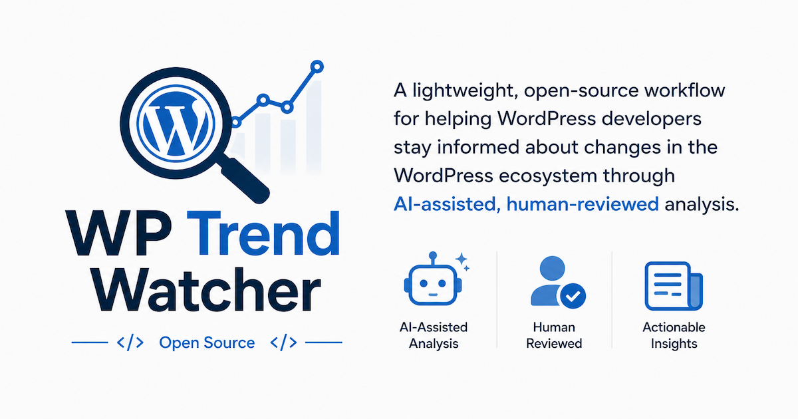

# WP Trend Watcher



WP Trend Watcher is a lightweight, open-source workflow for helping WordPress developers stay informed about changes in the WordPress ecosystem through AI-assisted, human-reviewed analysis.

The goal is not to automate opinions, replace expertise, or publish without review.

The goal is to collect useful WordPress ecosystem updates, summarize them efficiently, review them with human judgment, and produce a weekly report that developers can actually use.

## Latest Reports

Published weekly reports are available at [colorful-tones.github.io/wp-trend-watcher](https://colorful-tones.github.io/wp-trend-watcher/).

## Intended Audience

Freelance and agency WordPress developers who want to stay current without reading every Make post, Developer Blog update, and ecosystem article.

## Requirements

- **Node.js 22** (pinned in `.nvmrc` and `engines`). nvm is recommended for version management but not required.
- **pnpm 11** (pinned in `packageManager`). Corepack ships with Node.js and provides the correct pnpm version automatically when enabled.
- **Corepack enabled** — run `corepack enable` once per machine.
- **git** — to clone the repo.
- **A local LLM provider** for summarization: LM Studio, Ollama, or any OpenAI-compatible endpoint. Collection, doctor, and review work without one, but summarization requires it.
- **macOS, Linux, or WSL2**. The tooling assumes a Unix-like environment.

## Quick Start

```bash
git clone https://github.com/colorful-tones/wp-trend-watcher.git
cd wp-trend-watcher
nvm use
corepack enable
pnpm install
cp .env.example .env   # edit if using a different model or provider
cp sources.example.yaml sources.yaml  # optional: customize sources
pnpm collect           # add -- --days 7 for recent articles
pnpm summarize         # requires a local LLM endpoint for summarization
```

Summarization requires a local LLM provider (see Requirements above). LM Studio users should set `WP_TREND_MAX_TOKENS=2048` in `.env` for predictable report generation. The CLI automatically loads `.env` from the project root.

## What This Does

```bash
pnpm collect         # Fetch RSS feeds from 6 sources (4 Tier 1 + 2 Tier 2), store articles as JSON
pnpm summarize       # Fetch article content, generate summaries, synthesize the weekly report, and build HTML + index
pnpm generate-report # Regenerate the report from saved article summaries
pnpm index-page      # Regenerate the reports index.html listing page
pnpm doctor          # Check environment readiness before first summarize
pnpm review          # Review checklist for the latest report
pnpm generate-descriptions # Fill or regenerate SEO descriptions
pnpm weekly          # Run the full weekly workflow (doctor → collect → summarize → review → review server)
```

`pnpm weekly` is the recommended single-command workflow. It runs doctor, collect, summarize, and review sequentially, then starts a local review server at http://127.0.0.1:3001/review where you can view automated checks, read the rendered report, and save your "What I'm Watching" observations. Saving through the review page updates the canonical Markdown report, asks the configured LLM to generate the final SEO description from the reviewed report, and regenerates HTML. Press Ctrl-C to stop the server when you're done.

Use `pnpm weekly -- --no-open` to skip the automatic browser launch.

Individual commands remain available for diagnosis and recovery — for example, running `pnpm collect` or `pnpm summarize` separately when you only need that step.

`pnpm summarize` produces an HTML report alongside the Markdown file and writes shared report styles to `reports/assets/report.css`. The Radio Canada variable font is copied to `reports/assets/` alongside it. Reports are deployed to [GitHub Pages](https://colorful-tones.github.io/wp-trend-watcher/) on every push to `main` via the `pages.yml` workflow. Configure GitHub Pages to deploy from the `github-pages` environment (Settings → Pages → Source: GitHub Actions).

Generated report pages include Style and Mode controls for Aurora Blueprint, Aurora Mesh, and Signal Stripe, with Light, Dark, and System modes. The selected preferences are saved in the browser's local storage and reused across the report index and individual reports.

Generated reports also include concise SEO metadata in the canonical Markdown source. The title is created during report synthesis; the description is created after human review notes are saved. The description is used for page metadata, Open Graph/Twitter cards, the visible report introduction, and report index-card summaries. If generation is unavailable, the human save still succeeds and HTML uses a safe generic fallback.

To backfill historical reports, run `pnpm generate-descriptions` to fill reports without descriptions, or `pnpm generate-descriptions --all` to regenerate every report. Use `pnpm generate-descriptions --date YYYY-MM-DD` to target one report.

See [Summarization](docs/summarization.md) for provider configuration, model options, and synthesis strategy.

## Project Principles

- Human reviewed.
- Budget conscious.
- Provider agnostic.
- Open source first.
- Simple before clever.

See:

- [Weekly Workflow](docs/weekly-workflow.md)
- [Project Philosophy](docs/philosophy.md)
- [Sources](docs/sources.md)
- [Summarization](docs/summarization.md)
- [Human Review](docs/human-review.md)
- [Report Themes](docs/report-themes.md)
- [Cost Notes](docs/cost-notes.md)
- [Contributing](CONTRIBUTING.md)

## Feedback & Sources

Found a gap in the latest report? [Open a report feedback issue](https://github.com/colorful-tones/wp-trend-watcher/issues/new?template=report-feedback.yml).

Want to suggest a new RSS source? [Open a source suggestion issue](https://github.com/colorful-tones/wp-trend-watcher/issues/new?template=source-suggestion.yml).

Both templates walk you through what's needed — takes about a minute.

## Changelog

### 0.10.0

- Moved SEO description generation to the post-review workflow so descriptions include final human notes.
- Added `pnpm generate-descriptions` for filling or regenerating historical report descriptions.

### 0.9.0

- Added generated SEO titles and descriptions to reports, including visible report introductions and concise descriptions on index cards.
- Reused generated metadata for report page titles, descriptions, canonical social metadata, and index-card headings.

### 0.8.0

- Added GitHub project links to the report index and individual report footers.
- Added persistent report style and color-mode controls with accessible light and dark variants for all three visual directions.

For older releases, see the [GitHub Releases page](https://github.com/colorful-tones/wp-trend-watcher/releases).
